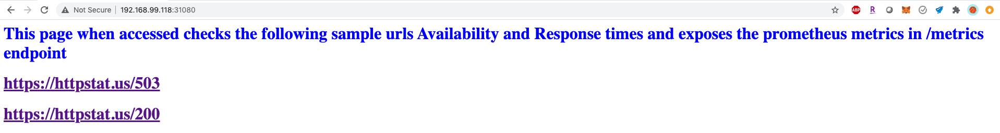
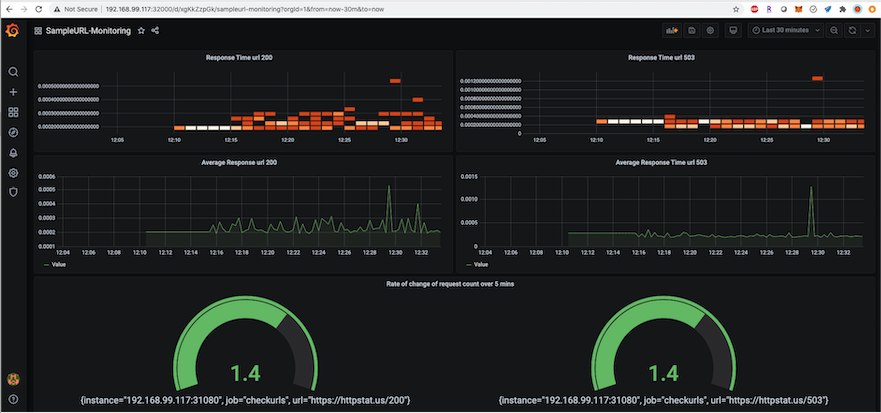

# checksampleurls
Setup for building, deploying and monitoring a simple service to a kubernetes cluster which checks sample urls (https://httpstat.us/503 & https://httpstat.us/200) for availability and measures the response times. The service also exports the collected metrics in prometheus format in /metrics url

k8s.sh contains the complete steps from scrtach which includes commands for installing minikube on Mac, building, pushing the images to docker hub(used my personal docker hub repository grajappan4401/checksampleurls) and deploying to minikube 

Deploy-to-Minikube.sh contains the steps just to deploy the service to an existing minikube

checkurls_service.py is the actual python implementation of the service.  
test_checkurls_service.py containts the Unit tests for the service. Unitests can be executed directly by running the python code.  

python3 test_checkurls_service.py.   

checkurls_service.yaml contains the kubernetes spec for deploying the service.   
Once deployed on to minikube the service can be accessed using http://"Minikube-IP-Address":31080

Accessing the /metrics endpoint shows the recorded/exposed metrics

prom-graf.yaml contains the kuberenetes spec for deploying prometheus and grafana on the same minikube cluster
Prometheus can be accessed at http://"Minikube-IP-Address":32090 
Accessing the url records the availability of the sample urls and measures the response times and exposes them as prometheus metrics on /metrics endpoint

Grafana can be accessed at http://"Minikube-IP-Address":32000 with default user id and password as admin/admin. This code contains few visualizations thats gets provisioned automatically when the grafana service is deployed. New visualizations can be created using the metrics from prometheus

